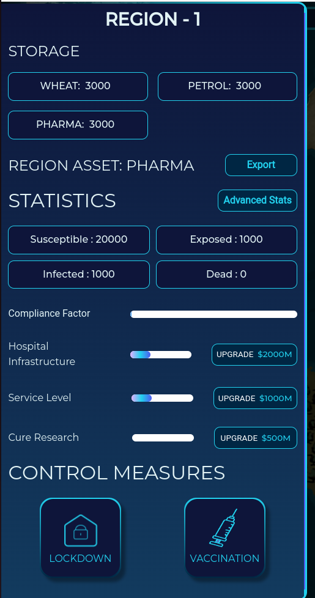
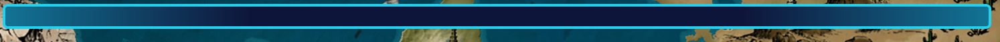
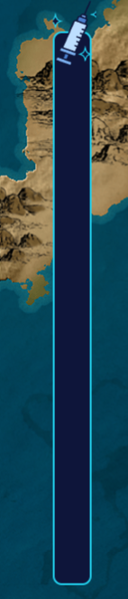
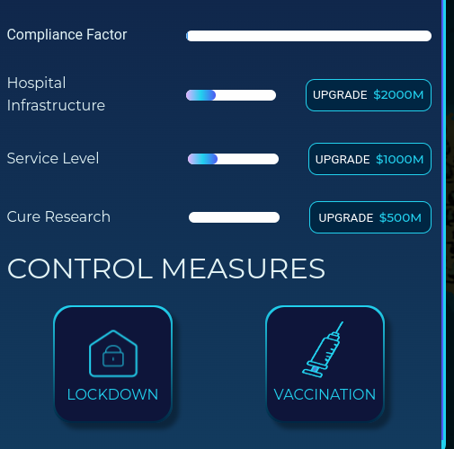
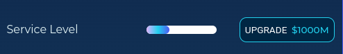

# Game Components

## Sidebar: 
The sidebar contains detailed information about each region's assets, storage, and statistics. Users can export assets and implement control measures with ease. Simply click on the desired region to access the sidebar for that region.

## News Reels:
The News Reels section features the most up-to-date breaking news, conveniently located at the top of the page

## Cure Research:
The Cure Research Progress Tracker is your key to defeating the virus. By tracking the progress of your cure research, you can develop effective cures

## User Actions:
Access the sidebar and select the desired control measure to implement, whether it be imposing lockdown or administering vaccines to the population. You can also upgrade.

## Services Per Region:
The services in the region can be upgraded. Click on the upgrade button near service level 

## Exports:
Each region has a specific asset that can be exported. To do so, simply click on the export option next to the commodity. You can then choose which region to export it to. The quantity can be selected as well. The risk is also shown as well as the cost

