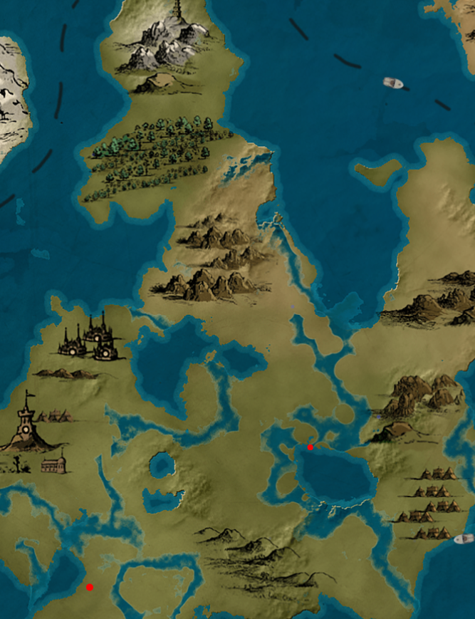

# Region 2
- **Xyrus**  — Moderate:

Xyrus is a region with moderate temperature and abundant wheat fields. It's known for exporting high-quality wheat that's grown and harvested by skilled farmers. The region has a scenic landscape of rolling hills and vast fields

