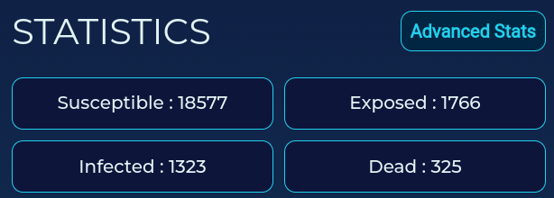

# SideBar

## Storage: 
The storage shown in the sidebar will show the amount of necessary goods each region has. The amount of these three goods must not go below the minimum amount in order to sustain the population of that region.

## Region Asset:
The Region Asset of that particular region is the commodity that the region produces and the user can export. To export the region asset click on the export button to the right of 'Region Asset'.

You can then choose where to export the asset by clicking on either one of the other two regions .

Then decide the quantity you want to export by making use of the slider.

The cost of exporting will be shown in the bottom left and the risk of export will be shown to the bottom right. Then click on the export button to export the commodity.

## Statistics:
The statistics will give you the information about the population. 

Click on 'Advance Stats' to the right to get more detailed information about the immunity of the population as well as the revenue per turn, service type and the status of the active actions.

There is also an informative graph to help the user visualize.

## Upgrade Infrastructures:
To upgrade the hospital infrastructure, service level and the cure research, click on the upgrade button to the right of them.

## Control Measure:
You can vaccinate and impose lockdown on a particular region by clicking on the buttons at the bottom of the side bar.

### Lockdown:

On clicking on the lockdown button, you will be able to see the lockdown level, the cost and the the days to lift the lockdown ( if it is already existing). There is also the option to upgrade the lockdown.

### Vaccination:

On clicking on the vaccination button, you will be able to see the vaccination level and the cost as well as the effect it has on children, the youth population and the elderly as well as the days to go till you can upgrade.

